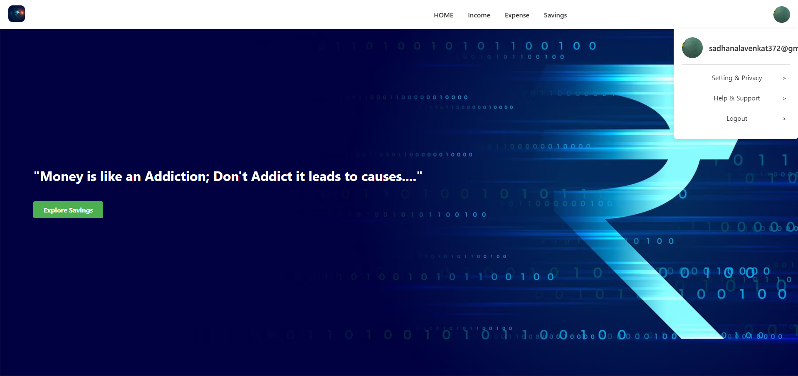

# Expense Tracker

Expense Tracker is a full-stack MERN (MongoDB, Express.js, React.js, Node.js) application designed to help users manage their personal finances. Users can register, log in, add income and expenses, and track their savings. The project incorporates DevOps practices, including Git for version control, Docker for containerization, and Jenkins for CI/CD pipelines.



## Features

- **User Authentication**: Secure registration and login functionality.
- **Manage Transactions**: Add, update, and delete income and expense records.
- **Savings Tracking**: Automatically calculates total savings.
- **Responsive UI**: Built with React for a seamless user experience across devices.
- **RESTful API**: Powered by Node.js and Express for efficient backend operations.
- **Data Persistence**: MongoDB with Mongoose for reliable data storage.

## Tech Stack

- **Frontend**: React.js, Axios
- **Backend**: Node.js, Express.js, MongoDB/Mongoose
- **DevOps/Deployment**: Git, Docker, Jenkins CI/CD

## Installation

### Prerequisites
- Node.js and npm
- MongoDB
- Docker (optional for containerized deployment)
- Jenkins (optional for CI/CD)

### Clone the Repository
bash
git clone https://github.com/your-username/expense-tracker.git
cd expense-tracker

Backend Setup

Navigate to the backend directory:cd backend


Install dependencies:npm install


Create a .env file in the backend directory with the following:MONGO_URI=your_mongodb_connection_string
JWT_SECRET=your_secret_key
PORT=5000


Start the backend server:npm run dev


Frontend Setup

Navigate to the frontend directory:cd frontend


Install dependencies:npm install


Start the frontend development server:npm start

The frontend runs on http://localhost:3000 and communicates with the backend.


Usage

Open the application in your browser: http://localhost:3000
Register a new account or log in with existing credentials.
Add income and expense entries to manage your finances.
View your total savings and expense breakdown on the dashboard.

DevOps Integration

Git: Used for version control to track all project changes.
Docker: Containerizes the application for consistent deployment.docker build -t expense-tracker .
docker run -p 5000:5000 expense-tracker


Jenkins CI/CD: Automates building, testing, and deployment on code changes.


Folder Structure
expense-tracker/
├── backend/          # Node.js + Express API
│   ├── models/       # Mongoose schemas
│   ├── routes/       # API routes
│   ├── controllers/  # Business logic
│   └── server.js     # Entry point
├── frontend/         # React app
│   ├── src/
│   │   ├── components/
│   │   ├── pages/
│   │   ├── redux/
│   │   └── App.js
├── docker-compose.yml
├── Dockerfile
└── README.md

Contributing

Fork the repository.
Create a new branch:git checkout -b feature-name


Make your changes and commit:git commit -m "Add feature"


Push to your branch:git push origin feature-name


Open a Pull Request.

Screenshots

Languages

JavaScript: 86.7%
CSS: 11.1%
HTML: 2.2%

Resources

MongoDB Documentation
React Documentation
Node.js Documentation
Docker Documentation
Jenkins Documentation

License
This project is licensed under the MIT License.```
