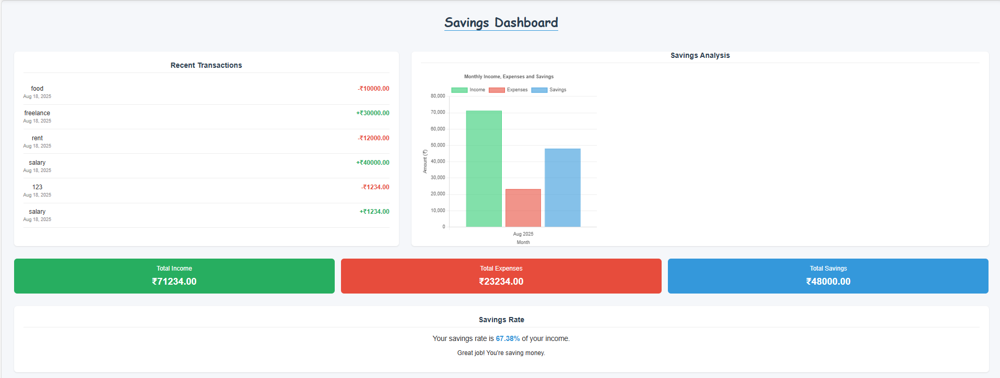
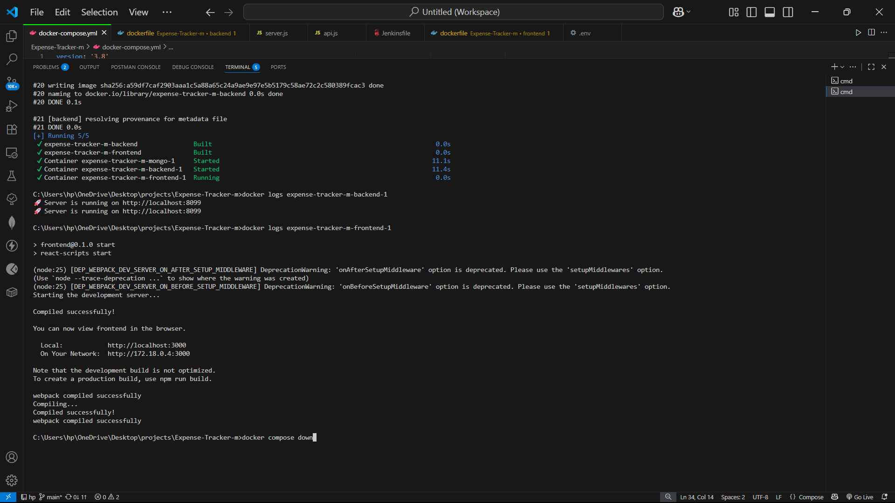

# 💰 Expense Tracker

**Expense Tracker** is a full-stack MERN (MongoDB, Express.js, React.js, Node.js) application designed to streamline personal finance management. Users can register, log in, add income and expenses, and track savings through a responsive, user-friendly interface. The project integrates DevOps practices, including Git for version control, Docker for containerization, and Jenkins for automated CI/CD pipelines, ensuring a robust and scalable solution.


---

## 📌 Project Overview

Expense Tracker is a comprehensive tool for managing personal finances, built with the MERN stack for seamless frontend-backend integration. The application features secure authentication, transaction management, and real-time savings calculations. DevOps practices like Docker and Jenkins enhance deployment reliability, while Git enables collaborative development.

### 🔑 Key Achievements
- Developed secure JWT-based authentication for user management.
- Implemented CRUD operations for income and expense tracking.
- Created a responsive frontend with react for efficient state management.
- Containerized the application with Docker for consistent environments.
- Automated build, test, and deployment processes using Jenkins CI/CD.

---

## 🚀 Features

- **User Authentication**: Secure registration and login with JSON Web Tokens (JWT).
- **Transaction Management**: Add, update, and delete income and expense records.
- **Savings Tracking**: Automatically calculates total savings based on transactions.
- **Responsive UI**: Built with React for a seamless experience across devices.
- **RESTful API**: Powered by Node.js and Express for efficient data handling.
- **Data Persistence**: MongoDB with Mongoose for reliable storage.

---

## 🛠 Tech Stack

| Layer      | Technologies Used                          |
|------------|--------------------------------------------|
| Frontend   | React.js, Axios                     |
| Backend    | Node.js, Express.js, MongoDB, Mongoose     |
| DevOps     | Git, Docker, Jenkins                       |

---

## 📦 Installation

### Prerequisites
- Node.js and npm (v16+)
- MongoDB (local or Atlas)
- Docker (optional)
- Jenkins (optional)
- Git

### Clone the Repository
```bash
git clone https://github.com/Ramana372/Expense-Tracker.git
cd expense-tracker
```

### Backend Setup
```bash
cd backend
npm install
```

Create a `.env` file in the `backend/` directory:
```env
MONGO_URI=mongodb://mongo:27017/database name
JWT_SECRET=your_secret_key
PORT=5000
```

Start the backend server:
```bash
npm run dev or
node server.js
```

### Frontend Setup
```bash
cd frontend
npm install
npm start
```

Frontend runs at `http://localhost:3000` and communicates with backend at `http://localhost:5000`.

---

## 💡 Usage

1. Open your browser and navigate to `http://localhost:3000`.
2. Register a new account or log in.
3. Add income and expense entries.
4. View your total savings and expense breakdown on the dashboard.

---

## ⚙️ DevOps Integration

- **Git**: Version control for collaborative development  
  Repository: [GitHub](https://github.com/Ramana372/Expense-Tracker.git)

- **Docker**: Containerized deployment
  ```bash
  docker build -t expense-tracker .
  docker run -p 5000:5000 expense-tracker
  ```

- **Jenkins CI/CD**: Automates build, test, and deployment on code changes

---

## 🤝 Contributing

Contributions are welcome!  
To contribute:

```bash
# Fork the repository
# Create a new branch
git checkout -b branch-name

# Make changes and commit
git commit -m "Add your feature description"

# Push to your branch
git push origin branch name
```

Then, open a Pull Request on GitHub. Please follow coding standards and include tests for new features.

---

## 📊 Screenshots

- **Dashboard**: Financial overview and savings
- **Income Page**: Manage income entries
- 
- **Expenses Page**: Track and categorize expenses
- 
- **Savings Overview**: Visualize savings progress
- 
- **Docker Execution**: Containerized deployment in action
- 

---


## 📚 Resources

- [MongoDB Documentation](https://www.mongodb.com/docs/)
- [React Documentation](https://reactjs.org/docs/getting-started.html)
- [Node.js Documentation](https://nodejs.org/en/docs/)
- [Docker Documentation](https://docs.docker.com/)
- [Jenkins Documentation](https://www.jenkins.io/doc/)

---

## 📬 Contact

For questions or feedback, create a GitHub Issue or contact the maintainer at:  
📧 `your-sadhanalavenkat372@gmail.com`

---

⭐️ Star this repository if you find it useful!  
🚀 Contribute to enhance Expense Tracker!
